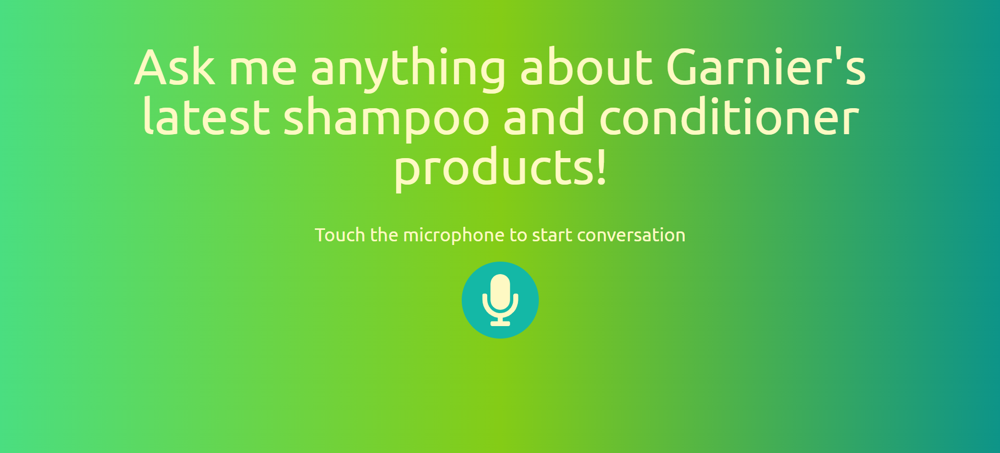

# AI Speech Bot

## Overview

Welcome to the AI Speech Bot project! This application leverages advanced Local Language Models (LLMs) to provide an interactive voice-based interface for users to inquire about products. Designed with flexibility and extensibility in mind, the bot uses the Ollama framework and currently integrates with the Llama3 model. It was originally developed for Garnier but is adaptable for use with any company's products.

The project comprises a React-based frontend for user interactions and a Flask backend for processing queries through the LLM. Users can engage with the bot by speaking into their microphone, and the system will respond with relevant information based on the product data.

### Application Screenshot


## Features

- **Voice Interaction**: Users can speak their questions into the microphone.
- **Flexible Model Integration**: Swap out the Llama3 model for other compatible models with ease.
- **Customizable Responses**: Modify the system message to tailor the bot's persona and responses to specific needs.

## Project Structure

- **frontend/**: Contains the React application for user interaction.
- **backend/**: Includes the Flask application and configuration for the Llama3 language model.

## Getting Started

### Prerequisites

Ensure you have the following installed:
- **Node.js** and **npm** (for frontend development)
- **Python** and **pip** (for backend development)
- Local setup of the Llama3 language model (or another compatible model)

### Running the Frontend

Navigate to the `frontend` directory and start the React application:

```bash
cd frontend
npm install
npm start
```

The frontend will be accessible at [http://localhost:3000](http://localhost:3000).

### Running the Backend

Navigate to the `backend` directory and start the Flask application:

```bash
cd backend
pip install -r requirements.txt
flask run
```

The backend will be accessible at [http://localhost:5000](http://localhost:5000).

## Using the Application

1. Open the frontend application in your web browser ([http://localhost:3000](http://localhost:3000)).
2. Click the microphone button to start voice input.
3. Speak your query related to the products.
4. The query will be processed by the Flask backend using the Llama3 model (or another configured model), and the response will be displayed on the frontend.

## Configuration

To customize the bot's responses, modify the system message in `backend/main.py`. This message dictates the bot's persona and can be adjusted to fit different use cases.

## Contributing

We welcome contributions to enhance this project! Feel free to submit issues or pull requests. Your feedback and improvements are highly appreciated.

## License

This project is licensed under the MIT License. See the [LICENSE](./LICENSE) file for details.

## Tools and Technologies

- **React**: For building the user interface.
- **Flask**: For the backend framework.
- **Llama3**: For the language model.

Thank you for using and contributing to the AI Speech Bot project!